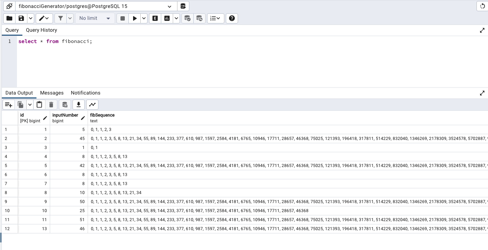

# Backend App: Fibonacci Generator

This backend application is a RESTful API built using Node.js with Express.js and Sequelize for generating and storing Fibonacci sequences. It provides an endpoint that takes a positive integer as input, generates the corresponding Fibonacci sequence, and stores it in a PostgreSQL database. If the sequence for a particular input number has already been generated and stored, the API returns the existing sequence from the database.

## Table of Contents

- [Getting Started](#getting-started)
  - [Prerequisites](#prerequisites)
  - [Installation](#installation)
    - [Database Setup](#database-setup)
- [Usage](#usage)
- [Endpoints](#endpoints)
- [Error Handling](#error-handling)


## Getting Started

### Prerequisites

Before running the application, you need to have the following installed on your system:

- Node.js
- PostgreSQL

### Installation

1. Clone the repository:

```
git clone https://github.com/your-username/your-repository.git
cd your-repository
```

2. Install the dependencies:

```
npm install
```

### Database Setup

Make sure you have PostgreSQL installed and running.
Download PostgreSQL through this link https://www.postgresql.org/docs/current/tutorial-install.html and you can also download the application pgAdmin4 here https://www.pgadmin.org/download/
Follow the steps in the following link to create a database and a table. (https://www.pgadmin.org/docs/pgadmin4/development/getting_started.html)

You can create a table as shown below for the Fibanocci Generator.
Here id column (Datatype in PostgreSQL: bigint) is the primary key. inputNumber column (Datatype in PostgreSQL: bigint) will have the number given by the user and fibSequence column (Datatype in PostggreSQL: test) will have the Fibanocci sequence.



Now you can access the database at ease. Note down the credentials while creating the database because you will need to create a .env file adn store them in it.
The credentials are stored in the .env file and it should look like below:

```
DB_DATABASE=fibonacciGenerator
DB_USERNAME=postgres
DB_PASSWORD=password
DB_HOST=localhost
DB_DIALECT=postgres
```

These are then called from 'src/config/database.ts' to connect to the PostgreSQL Database.

## Usage

To test the server, run the following command:

```
npm test
```

To start the server, run the following command:

```
npm start
```

The server will start listening on the specified port (default is 5000) and connect to the PostgreSQL database.

## Endpoints

### Generate Fibonacci Sequence

**URL**: `/api/fibonacci`

**Method**: `POST`

**Request Body**:
```json
{
  "inputNumber": 10
}
```

- `inputNumber` (number, required): The positive integer for which to generate the Fibonacci sequence.

**Response**:
```json
{
  "fibonacciNumbers": [0, 1, 1, 2, 3, 5, 8, 13, 21, 34]
}
```

- `fibonacciNumbers` (array of numbers): The generated Fibonacci sequence.

**Status Codes**:
- `200 OK`: The Fibonacci sequence was successfully generated and returned.
- `400 Bad Request`: The provided input number is not a valid positive integer.
- `500 Internal Server Error`: An error occurred while generating/fetching the Fibonacci sequence.

## Error Handling

In case of errors, the API will return appropriate error responses with corresponding status codes. The possible error responses include:

- `400 Bad Request`: When the input number is not a valid positive integer.
- `500 Internal Server Error`: When an unexpected error occurs during generating/fetching Fibonacci data.
